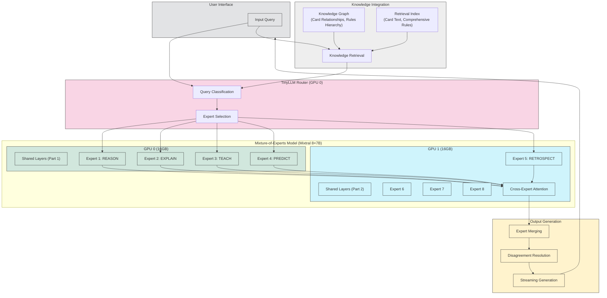

# MTG AI Assistant: Executive Summary & Technical Vision

## Executive Summary

The MTG AI Reasoning Assistant is a specialized AI system designed to support Magic: The Gathering (MTG) players by providing real-time, expert-level game analysis and strategic guidance. By leveraging a Mixtral 8×7B Mixture-of-Experts (MoE) architecture and advanced fine-tuning via QLoRA, the assistant operates efficiently on a consumer-grade dual 16GB GPU setup. It supports multiple reasoning modes—**REASON, EXPLAIN, TEACH, PREDICT, and RETROSPECT**—each corresponding to a dedicated expert module.

**Core Innovations:**

- **Transaction-Based MoE Routing:** A lightweight TinyLLM classifier routes each complete query to one or more experts. This "transaction" approach avoids per-token routing overhead while ensuring consistent reasoning style.
- **Expert Personality Specialization:** Each expert is fine-tuned on mode-specific data. For instance, the REASON expert focuses on rule application and step-by-step logic, while the TEACH expert provides didactic, user-friendly explanations.
- **QLoRA on Dual GPUs:** The system uses 4-bit quantization and low-rank adaptation to fine-tune the base model and expert layers efficiently within a 32GB VRAM limit.
- **Hybrid KG/RAG Integration:** By combining a Knowledge Graph (for structured rules and card relationships) with a Retrieval-Augmented Generation system, the assistant achieves high factual accuracy.
- **Expert Disagreement Resolution:** A novel mechanism allows conflicting expert outputs to be reconciled via cross-attention and confidence-based weighting.

## Technical Approach & Vision

The assistant's architecture is engineered to solve the unique challenges of MTG gameplay analysis. During a session, the user's query—augmented with context from MTG rules and card data—is first classified by the TinyLLM router. Based on the router's decision, the system dynamically activates one or more expert modules within the Mixtral 8×7B framework. For example, a query about a complex stack interaction may trigger both the REASON and PREDICT experts, with their outputs merged via a custom cross-expert attention layer.

A detailed byte-level memory allocation plan ensures that all components—from the quantized base model to the LoRA adapters and retrieval cache—fit within a strict 32GB VRAM budget. Optimizations such as aggressive 4-bit quantization, gradient checkpointing, and strategic sharding across GPUs are employed to prevent OOM errors during both training and inference.

By integrating expert knowledge transplantation, the system is designed to scale seamlessly to larger MoE architectures in the future. The end result is an AI assistant that not only provides rapid and accurate MTG analysis but also continuously improves via an integrated A/B testing and evaluation pipeline that compares expert configurations against human expert performance.

## Model Selection Rationale

Choosing the right base model is critical for handling MTG's complexity. We compare **Mixtral 8x7B** (a Mixture-of-Experts model by Mistral AI) with alternative open-source LLMs, focusing on reasoning capability, efficiency, and architecture:

### Mixtral 8x7B (Mistral)

This model uses a **sparse Mixture-of-Experts (MoE)** architecture: 8 expert sub-models (~7B parameters each) with a router that activates only 2 experts per token. Effectively, each token is processed by ~13B parameters (2×7B), while total parameters (~46.7B) provide a rich knowledge capacity. This yields _performance comparable to much larger models_ (it outperforms Meta's Llama-2 70B on most benchmarks, and even matches or exceeds GPT-3.5 on many tasks) but with far lower computation per token.

The router ensures only a fraction of weights are active at a time, making inference ~6× faster than using a full 70B model. Mixtral also supports a **32k token context window** – crucial for MTG where long rule texts or multiple card details might need to be considered at once. These advantages make Mixtral 8x7B a strong candidate for complex reasoning in MTG. However, its MoE design means the full model is larger to store in memory (all 8 experts ~46.7B parameters need to be loaded).

### Alternative Models Considered

- **LLaMA-2 and Derivatives**: LLaMA-2 is a family of dense decoder-only models (7B, 13B, 70B) from Meta. The 70B variant is a top-performing open model for reasoning and knowledge, but it requires significantly more resources (all 70B parameters active per token). In contrast, Mixtral achieves similar or better results with only ~13B active parameters. Smaller LLaMA-2 models (13B or 7B) would be easier to fine-tune but may struggle with MTG's complexity.

- **Falcon-180B (2023)**: This dense 180B parameter model requires ~8×A100 GPUs (∼400GB VRAM) for inference, whereas Mixtral-8×7B can outperform Falcon on many tasks within a 32GB VRAM budget.

- **DeepSeek-MoE (2024)**: A 16.4B total parameter model, using ~2.8B active per token (~18%). Fine-grained experts + shared experts yield high specialization. Achieves LLaMA-7B quality with ~40% of its active FLOPs.

- **GLaM (2022)**: A 1.2T MoE model with 64 experts, using ~1/2 inference FLOPs of GPT-3 for better few-shot NLP performance. Validates MoE scaling at extreme sizes.

### Model Comparison Table

| Model            | Parameters | Active Parameters | Context Length | Performance Level         | Hardware Required    | Viable for Our Setup     |
| ---------------- | ---------- | ----------------- | -------------- | ------------------------- | -------------------- | ------------------------ |
| **Mixtral 8×7B** | 46.7B      | ~13B (2 experts)  | 32k            | Comparable to GPT-3.5     | 2×16GB GPUs          | ✅ Yes                   |
| LLaMA-2-70B      | 70B        | 70B (all)         | 4k             | Strong, but below Mixtral | ~4×24GB GPUs         | ❌ Too large             |
| Falcon-180B      | 180B       | 180B (all)        | 2k             | Very strong               | ~8×A100 GPUs (400GB) | ❌ Far too large         |
| DeepSeek-MoE     | 16.4B      | ~2.8B (18%)       | 4k             | Similar to LLaMA-7B       | 1-2×16GB GPUs        | ✅ Yes, but less capable |
| GLaM             | 1.2T       | Variable          | 2k             | Better than GPT-3         | Specialized hardware | ❌ Not open-source       |

### Recommendation

Use **Mixtral 8x7B** as the base model for the MTG AI Assistant. Its high benchmark performance in code and reasoning tasks suggests it can handle MTG's complexity. The large context window (32k) is a significant benefit for reading long card lists or rule documents. Alternative open models (like LLaMA-2-70B or Falcon-180B) could be considered if Mixtral integration proves difficult, but they would require more optimization to run within our hardware constraints.

## Five Expert Reasoning Modes Overview

Our assistant defines five expert personas, each aligned with one reasoning mode, corresponding to specialized neural experts within the MoE model:

### REASON Expert

Specializes in step-by-step logical reasoning, rules interpretation, and deduction. This expert thinks through the sequence of game events, rule applications, and consequences.

### EXPLAIN Expert

Excels at articulating MTG rules and decisions in human-friendly language. It provides detailed explanations and justifications, aiming for clarity and educational value.

### TEACH Expert

Focuses on instructional output. It breaks down concepts for a learner, suggests practice scenarios, and adapts explanations for different skill levels.

### PREDICT Expert

Simulates future game states and probabilities. It evaluates possible moves, estimates outcomes (e.g. "If you attack now, opponent likely blocks with X and you trade creatures."), almost like a mini game engine.

### RETROSPECT Expert

Analyzes past plays or games. It identifies mistakes, alternative lines, and lessons learned from prior turns or completed games.

Each expert is essentially a subset of model weights (primarily the feed-forward layers) that has been fine-tuned on data relevant to its specialization. By targeted training, we encourage each expert to develop deep, non-overlapping knowledge, aligning with the principle of minimizing knowledge redundancy.

## System Architecture Overview

The system architecture is engineered for operation on dual 16GB GPUs (32GB total VRAM) using a memory-optimized approach. Key components include:

### Memory Allocation

- **Base Model (Quantized 4-bit)**: ~47B parameters ≈ 23.5 GB memory (for all experts + shared layers in 4-bit). Stored across 2 GPUs (each holds ~11.75 GB).
- **LoRA Adapters & Optimizer States**: << 1 GB. Low-rank adapters for each expert's feed-forward weights allow fine-tuning with minimal memory.
- **Routing Classifier**: ~100M parameters (TinyLLM) in 8-bit or 16-bit (~0.1 GB) for expert selection.
- **KG/RAG Index**: External knowledge stored on CPU or disk, with retrieved snippets temporarily moved to GPU as needed.

### Transaction-Based Routing

- The TinyLLM router classifies each query to determine which expert(s) should handle it
- The routing decision remains fixed for the entire interaction, ensuring consistent reasoning style
- Multiple experts can be activated simultaneously for complex questions

### Knowledge Integration

- **Knowledge Graph**: Encodes MTG concepts, card relationships, rule hierarchy
- **Retrieval Index**: Stores card text, comprehensive rules, and game states
- System injects retrieved knowledge into prompts before generation

### Expert Collaboration

- Custom cross-expert attention mechanism allows experts to exchange information
- Weighted output combination based on router confidence scores
- Disagreement resolution algorithm for reconciling conflicting expert outputs

### Inference Optimization

- Efficient streaming inference with KV caching
- Load balancing across GPUs
- Specialized CUDA kernels for MoE operations

## Case Study: Complex Stack Interaction Analysis

The following example illustrates how the MTG AI Assistant processes a complex game situation involving multiple card interactions, demonstrating the system's expert collaboration capability:

**User Query:** "If I cast Lightning Bolt targeting my opponent's Tarmogoyf, and they respond with Veil of Summer, then I activate my Cryptic Command to counter their Veil, what happens to the Lightning Bolt and Tarmogoyf?"

**System Processing Flow:**

1. **Knowledge Retrieval:**

   - The RAG system retrieves card texts for Lightning Bolt, Tarmogoyf, Veil of Summer, and Cryptic Command
   - Relevant comprehensive rules regarding the stack, targeting, and countering spells are also fetched

2. **Router Classification:**

   - The TinyLLM router analyzes the query and activates both the **REASON** expert (0.92 confidence) and **EXPLAIN** expert (0.78 confidence)
   - The query involves stack resolution logic (REASON) and needs clear explanation of rule interactions (EXPLAIN)

3. **Expert Processing:**

   - **REASON Expert:** Analyzes the stack in proper order (last-in, first-out), determines Cryptic Command resolves first, countering Veil of Summer. With Veil countered, Lightning Bolt's targeting remains legal and it resolves, dealing 3 damage to Tarmogoyf.
   - **EXPLAIN Expert:** Formulates a clear, step-by-step explanation of the resolution sequence, referencing relevant rules in user-friendly language.
   - **Cross-Expert Attention:** The experts exchange information - REASON provides the logical sequence while EXPLAIN contributes clarity for the user.

4. **Output Generation:**
   - The expert outputs are merged with attention-weighted combination
   - The system generates a streaming response, prioritizing clarity while maintaining technical accuracy

**Final Response to User:**
"Here's what happens in this scenario:

1. You cast Lightning Bolt targeting your opponent's Tarmogoyf.
2. Your opponent responds by casting Veil of Summer.
3. You respond by activating Cryptic Command, choosing to counter their Veil of Summer.

Since the stack resolves in reverse order (last-in, first-out):

- Cryptic Command resolves first, countering Veil of Summer.
- Veil of Summer is countered and has no effect.
- Lightning Bolt resolves next, dealing 3 damage to Tarmogoyf.

Whether Tarmogoyf dies depends on its toughness at resolution time. Remember that Tarmogoyf's power and toughness are determined by card types in graveyards, so you'd need to check if 3 damage is lethal based on the current board state."

This example demonstrates how the system combines precise rules knowledge with clear explanation, leveraging multiple expert perspectives to provide a comprehensive and accurate answer.

## Expected Outcomes & Success Metrics

- **Enhanced MTG Analysis:** The assistant will produce accurate, rule-compliant game analyses and strategic insights comparable to professional judges and top-level players.
- **Real-Time Responsiveness:** Optimized for consumer-grade hardware, the assistant will deliver sub-second latency on complex queries.
- **Scalability and Flexibility:** The design supports future scaling to multi-GPU systems and larger models, while its modular architecture permits iterative improvements.
- **User-Centric Improvements:** Continuous A/B testing and novel MTG-specific evaluation metrics will ensure that the system evolves based on real player feedback.

## Novel MTG-Specific Evaluation Framework

To assess MTG reasoning quality beyond general LLM benchmarks, we propose the following evaluation metrics:

### Quantitative Measures

- **Rule Application Accuracy (RAA):**
  - _Definition:_ The percentage of responses that correctly reference and apply official MTG rules.
  - _Measurement:_ Compare model outputs with a gold standard database of rulings.
- **Strategic Decision Quality (SDQ):**
  - _Definition:_ A score (0–100) reflecting the quality of in-game decisions.
  - _Measurement:_ Simulate game outcomes using a custom engine; compare the model's suggestions against expert moves.
- **Explanatory Clarity (EC):**
  - _Definition:_ A score (0–100) determined by linguistic analysis (readability metrics, semantic coherence) and human evaluation.
  - _Measurement:_ Use a combination of automated metrics (e.g., Flesch-Kincaid score) and user ratings.
- **Probabilistic Outcome Accuracy (POA):**
  - _Definition:_ Accuracy of predicted outcomes compared with simulation results.
  - _Measurement:_ Calculate mean squared error between predicted probabilities and simulation outcomes.

### Composite Scoring System

- **Overall MTG Reasoning Score (OMRS):**
  - _Formula:_ OMRS = 0.3 × RAA + 0.3 × SDQ + 0.2 × EC + 0.2 × (100 - MSE_POA)
  - _Interpretation:_ The higher the OMRS, the closer the assistant's performance is to that of a human expert judge.

### Benchmarking

- **Human Expert Comparison:**
  - Create a test set of 50 curated MTG scenarios, each answered by a panel of MTG judges.
  - Compare the assistant's responses using the above metrics.
- **Correlation with Standard Benchmarks:**
  - Although MTG is unique, measure correlations with general reasoning benchmarks (GSM8K, MMLU) to validate overall reasoning ability.

This evaluation framework allows us to measure the assistant's performance across all reasoning modes and ensure it meets the high standards required for MTG gameplay analysis.
