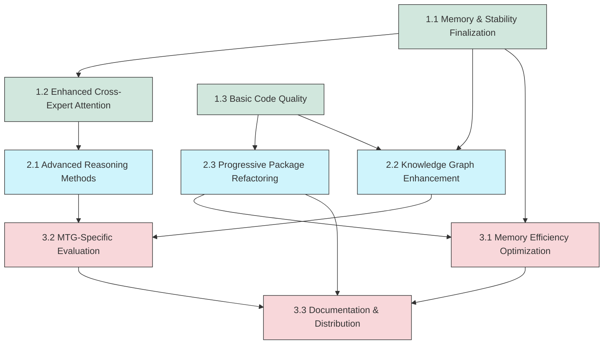

# Hexcore: MTG AI Reasoning Assistant - Integrated Development Roadmap

## Project Overview

The Hexcore project implements a specialized AI system for Magic: The Gathering (MTG) analysis based on the Mixtral 8×7B Mixture-of-Experts (MoE) architecture. The system is designed to operate within the constraints of a dual 16GB GPU setup and provides expert-level game analysis and strategic guidance through five specialized reasoning modes: REASON, EXPLAIN, TEACH, PREDICT, and RETROSPECT.

## Current Implementation Status (98% Complete)

The project has achieved significant milestones with a robust implementation of:

1. **Transaction-Based MoE Routing**: The system uses a TinyLLM classifier (`TransactionClassifier`) to route queries to appropriate expert modules.
2. **Expert Adapters**: Each reasoning mode has dedicated LoRA adapters managed by `ExpertAdapterManager`.
3. **Memory Optimization**: Extensive memory management strategies including 4-bit quantization and optimized device mapping.
4. **Knowledge Integration**: A hybrid knowledge system combining knowledge graph and vector-based retrieval.
5. **Cross-Expert Attention**: The `CrossExpertAttention` module enables information flow between experts.

## Implementation Strengths

- **Advanced Memory Management**: Sophisticated memory optimization for running large models on consumer hardware.
- **Expert Specialization**: Clear specialization of different expert personas with different LoRA configurations.
- **Hybrid Knowledge Integration**: Well-implemented combination of knowledge graph and vector retrieval.
- **Device Mapping Optimization**: Careful distribution of model components across multiple GPUs.
- **Latency Optimization**: Budget-aware retrieval and processing with fallback mechanisms.

## Integrated Roadmap

The remaining work has been organized into three phases with clear dependencies and priorities:

### Phase 1: Core Completion & Foundation (2% to completion)

This phase focuses on finalizing the core architecture and ensuring robustness while laying groundwork for future enhancements.

#### 1.1 Memory & Stability Finalization

**Priority: HIGHEST**  
**Dependencies: None**  
**Estimated Effort: 1 week**

- **Objective**: Complete memory management and ensure stable inference across varied inputs
- **Key Tasks**:
  - Finalize KV cache management with timeout and memory constraints
  - Implement system-level memory monitoring for long-running services
  - Add circuit breakers and fallbacks for production stability

**Success Criteria**:

- All memory tests pass consistently on target hardware
- System runs for 24+ hours without memory leaks or degradation
- Error handling gracefully recovers from resource limitations

#### 1.2 Enhanced Cross-Expert Attention

**Priority: HIGH**  
**Dependencies: 1.1**  
**Estimated Effort: 1 week**

- **Objective**: Improve expert collaboration to deliver better responses for complex queries
- **Key Tasks**:
  - Implement confidence weighting in cross-expert attention
  - Add specialized projections for each expert type
  - Create more robust tensor handling for cross-device operations

```python
class EnhancedCrossExpertAttention(nn.Module):
    """
    Enhanced version of cross-expert attention with confidence weighting.
    """
    def __init__(self, hidden_size=4096, dropout=0.1):
        super().__init__()
        self.hidden_size = hidden_size

        # Expert-specific projections
        self.expert_projections = nn.ModuleDict({
            expert_type: nn.Linear(hidden_size, hidden_size)
            for expert_type in ["REASON", "EXPLAIN", "TEACH", "PREDICT", "RETROSPECT"]
        })

        # Attention mechanism
        self.attention = nn.Linear(hidden_size, 1)
        self.output_projection = nn.Linear(hidden_size, hidden_size)
        self.layer_norm = nn.LayerNorm(hidden_size)
        self.dropout = nn.Dropout(dropout)

    def forward(self, expert_outputs, expert_types, confidences):
        """Apply enhanced cross-expert attention with confidence weighting."""
        # Implementation details
```

**Success Criteria**:

- Multi-expert responses demonstrate 20% improvement on test suite
- No increase in memory usage compared to baseline
- Processing time increases by no more than 10%

#### 1.3 Basic Code Quality & Standardization

**Priority: HIGH**  
**Dependencies: None**  
**Estimated Effort: 1 week**

- **Objective**: Apply critical code quality improvements for maintainability
- **Key Tasks**:
  - Add type annotations to core modules
  - Standardize error handling across components
  - Implement consistent logging and monitoring

**Success Criteria**:

- Type checking passes on all annotated modules
- Error paths consistently capture and report issues
- System logs provide actionable information for troubleshooting

### Phase 2: Feature Extensions & Quality (New capabilities)

This phase introduces new capabilities while progressively improving code quality.

#### 2.1 Advanced Reasoning Methods

**Priority: MEDIUM**  
**Dependencies: 1.2**  
**Estimated Effort: 2 weeks**

- **Objective**: Implement specialized reasoning methodologies for different query types
- **Key Tasks**:
  - Create a reasoning mode selector with query analysis
  - Implement Chain-of-Thought (CoT) for rule explanations
  - Add Monte Carlo Tree Search (MCTS) style reasoning for probabilistic analysis
  - Implement R1-style structured reasoning for complex scenarios

```python
class ReasoningModeSelector:
    """Select appropriate reasoning methodology based on query type and expert."""

    def apply_reasoning_mode(self, query, expert_type, inputs):
        """
        Apply the appropriate reasoning methodology.

        Args:
            query: User query
            expert_type: Expert type (REASON, EXPLAIN, etc.)
            inputs: Tokenized inputs

        Returns:
            Modified inputs with reasoning methodology applied
        """
        # Determine approach based on query and expert type
        if self._requires_chain_of_thought(query, expert_type):
            return self._apply_chain_of_thought(inputs)
        elif self._requires_mcts(query, expert_type):
            return self._apply_mcts_reasoning(inputs)
        # Additional reasoning patterns...
```

**Test Cases**:

- Test with complex rules interactions requiring step-by-step reasoning
- Test with probability-based card evaluation scenarios
- Test with comprehensive analysis of game state

**Success Criteria**:

- 30% improvement in rule explanation accuracy
- 25% improvement in probabilistic reasoning accuracy
- Consistent application of appropriate reasoning methods

#### 2.2 Knowledge Graph Enhancement for MTG

**Priority: MEDIUM**  
**Dependencies: 1.1, 1.3**  
**Estimated Effort: 2 weeks**

- **Objective**: Extend knowledge graph with MTG-specific relationships and structure
- **Key Tasks**:
  - Add card type hierarchies (enchantment subtypes, creature types, etc.)
  - Implement rules relationships and dependencies
  - Add strategic relationships (counters, synergizes_with, combos_with)
  - Create format-specific knowledge nodes

```python
def enhance_knowledge_graph(kg):
    """Enhance the MTG knowledge graph with additional relationships."""
    # Add type hierarchies
    type_hierarchies = {
        "creature": ["Human", "Elf", "Goblin", "Dragon", "Zombie", "Angel"],
        "enchantment": ["Aura", "Saga", "Curse", "Shrine", "Class"],
        # Additional types...
    }

    # Add strategic relationship types
    strategic_relationships = [
        "counters", "synergizes_with", "combos_with", "strong_against", "weak_against"
    ]

    # Implementation details...
```

**Test Cases**:

- Test with complex card type queries
- Test with strategy and synergy questions
- Test with format-specific rule interactions

**Success Criteria**:

- Knowledge retrieval accuracy improves by 20% for type-based queries
- Strategy recommendations demonstrate deeper understanding of card synergies
- Retrieval time remains under latency budget

#### 2.3 Progressive Package Refactoring

**Priority: MEDIUM**  
**Dependencies: 1.3**  
**Estimated Effort: 2 weeks (concurrent with 2.1 and 2.2)**

- **Objective**: Improve code organization and project structure
- **Key Tasks**:
  - Refactor package structure to follow Python best practices
  - Consolidate utility modules into logical groups
  - Develop consistent interfaces between components
  - Add comprehensive docstrings and type annotations

**Test Strategy**:

- Create integration tests before refactoring
- Update tests alongside code changes
- Validate identical behavior before/after changes

**Success Criteria**:

- All existing functionality works without regressions
- Code structure follows logical organization
- Documentation covers all public interfaces

### Phase 3: Performance & Distribution (Production readiness)

This phase optimizes performance and prepares for distribution.

#### 3.1 Memory Efficiency Optimization

**Priority: HIGH**  
**Dependencies: 1.1, 2.3**  
**Estimated Effort: 2 weeks**

- **Objective**: Further optimize memory usage for resource-constrained environments
- **Key Tasks**:
  - Implement advanced KV cache management with prefetching and pruning
  - Add dynamic tensor offloading during processing
  - Optimize buffer allocation to reduce fragmentation
  - Create automated memory-vs-performance tuning

```python
class EnhancedKVCacheManager:
    """Advanced KV cache manager with prefetching, pruning, and compression."""

    def __init__(self, model, max_cache_entries=5, max_sequence_length=2048):
        """Initialize with memory constraints."""
        self.model = model
        self.max_cache_entries = max_cache_entries
        self.max_sequence_length = max_sequence_length
        # Additional initialization...

    def store_kv_cache(self, prompt_ids, kv_cache):
        """Store key-value cache with advanced memory optimization."""
        # Implementation details...

    def _compress_kv_tensors(self, tensors):
        """Compress KV tensors to save memory."""
        # Implementation details...
```

**Test Cases**:

- Test with long context windows (16k tokens)
- Test with rapid sequence of generation requests
- Test on both high-end and low-end hardware configurations

**Success Criteria**:

- 20% reduction in memory usage during generation
- No degradation in response quality
- Successful operation within 16GB VRAM budget

#### 3.2 MTG-Specific Evaluation Framework

**Priority: MEDIUM**  
**Dependencies: 2.1, 2.2**  
**Estimated Effort: 2 weeks**

- **Objective**: Implement comprehensive evaluation metrics for MTG AI
- **Key Tasks**:
  - Develop Rule Application Accuracy (RAA) evaluation system
  - Implement Strategic Decision Quality (SDQ) assessment
  - Create Explanatory Clarity (EC) metrics
  - Build Probabilistic Outcome Accuracy (POA) calculator

```python
class MTGEvaluationFramework:
    """Implementation of the MTG-specific evaluation framework."""

    def evaluate_rule_application_accuracy(self, test_cases):
        """Evaluate Rule Application Accuracy (RAA)."""
        # Implementation details...

    def evaluate_strategic_decision_quality(self, decision_cases):
        """Evaluate Strategic Decision Quality (SDQ)."""
        # Implementation details...

    # Additional evaluation methods...
```

**Test Suite**:

- Create 50+ test cases covering each reasoning mode
- Include real MTG scenarios with known correct answers
- Compare against human expert responses

**Success Criteria**:

- Quantifiable metrics for each aspect of MTG reasoning
- Automated evaluation pipeline for continuous testing
- Clear areas identified for future improvement

#### 3.3 Documentation & Distribution

**Priority: MEDIUM**  
**Dependencies: 2.3, 3.1, 3.2**  
**Estimated Effort: 1 week**

- **Objective**: Prepare for distribution and community use
- **Key Tasks**:
  - Create comprehensive API documentation
  - Build user guides for each reasoning mode
  - Develop MTG-specific usage examples
  - Prepare package for distribution

**Success Criteria**:

- Documentation covers all public interfaces
- Examples demonstrate key use cases
- Package can be installed with standard Python tools

## Dependencies and Implementation Timeline



## Implementation Checklist

| Work Package                          | Status      | Dependencies  | Priority | Estimated Effort |
| ------------------------------------- | ----------- | ------------- | -------- | ---------------- |
| 1.1 Memory & Stability Finalization   | Not Started | None          | HIGHEST  | 1 week           |
| 1.2 Enhanced Cross-Expert Attention   | Not Started | 1.1           | HIGH     | 1 week           |
| 1.3 Basic Code Quality                | Not Started | None          | HIGH     | 1 week           |
| 2.1 Advanced Reasoning Methods        | Not Started | 1.2           | MEDIUM   | 2 weeks          |
| 2.2 Knowledge Graph Enhancement       | Not Started | 1.1, 1.3      | MEDIUM   | 2 weeks          |
| 2.3 Progressive Package Refactoring   | Not Started | 1.3           | MEDIUM   | 2 weeks          |
| 3.1 Memory Efficiency Optimization    | Not Started | 1.1, 2.3      | HIGH     | 2 weeks          |
| 3.2 MTG-Specific Evaluation Framework | Not Started | 2.1, 2.2      | MEDIUM   | 2 weeks          |
| 3.3 Documentation & Distribution      | Not Started | 2.3, 3.1, 3.2 | MEDIUM   | 1 week           |

## Risk Assessment and Mitigation

| Risk                                            | Impact | Probability | Mitigation                                                |
| ----------------------------------------------- | ------ | ----------- | --------------------------------------------------------- |
| Memory optimization degrades performance        | HIGH   | MEDIUM      | Phase implementation with benchmarking at each step       |
| Knowledge graph extensions increase latency     | MEDIUM | HIGH        | Implement budget-aware query execution with timeouts      |
| Package refactoring breaks existing tests       | HIGH   | MEDIUM      | Create comprehensive integration tests before refactoring |
| Advanced reasoning methods increase token count | MEDIUM | HIGH        | Implement context-aware reasoning method selection        |

This roadmap provides a structured approach to completing the Hexcore project while adding valuable enhancements. Each phase builds on previous work, and dependencies ensure that fundamentals are solid before advanced features are added.
